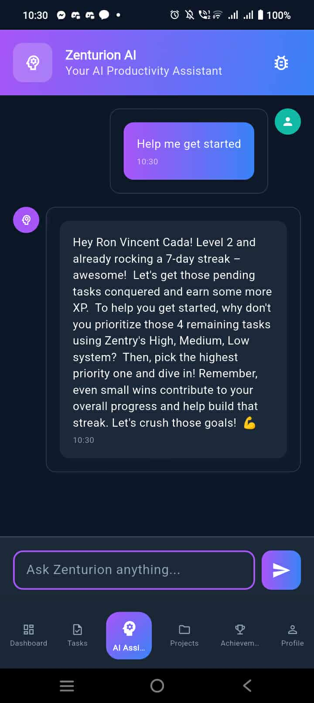

# 🎯 Zentry Mobile

<div align="center">

**A gamified productivity app that transforms task management into an engaging experience**

[](https://flutter.dev)
[](https://dart.dev)
[](LICENSE)
[](build/)

**🚀 [Download APK - Ready to Install!](https://github.com/lucifron28/zentry_mobile/blob/main/build/app/outputs/flutter-apk/ZentryMobile-v1.1.0-AI-Webhooks-Teams-20250630.apk)**

[Features](#-features) • [Installation](#-installation) • [Screenshots](#-screenshots) • [Team Management](#-team-management) • [AI Assistant](#-ai-assistant-zenturion)

</div>

---

## 🚀 Overview

Zentry Mobile is a cutting-edge productivity application that combines task management with gamification elements, team collaboration, and AI-powered assistance. Built with Flutter, it offers a seamless experience across platforms while keeping users motivated through XP systems, achievements, and intelligent recommendations.

### ⚡ Quick Start

1. **📱 Download & Install**: [Get the APK](https://github.com/lucifron28/zentry_mobile/blob/main/build/app/outputs/flutter-apk/ZentryMobile-v1.1.0-AI-Webhooks-Teams-20250630.apk) and install on your Android device
2. **🎯 Explore Demo**: Launch the app to see 4 pre-configured demo teams
3. **🤖 Try Zenturion**: Chat with the AI assistant (works offline in demo mode)
4. **👥 Join Teams**: Use invite codes like `ZENTRY2024` to join demo teams
5. **🏆 Earn XP**: Complete tasks and unlock achievements

### 🌟 What Makes Zentry Special

- **🎮 Gamified Productivity**: Turn boring tasks into engaging challenges
- **👥 Real Team Collaboration**: Full team management with roles and permissions
- **🤖 AI-Powered Assistant**: Zenturion helps with planning and motivation
- **📊 Live Analytics**: Real-time progress tracking and insights
- **🔗 Smart Integrations**: Discord and Teams webhook notifications
- **🎨 Beautiful Design**: Modern glassmorphism UI with smooth animations

## ✨ Features

### 📱 **Core Productivity**
- **Smart Task Management** - Create, organize, and track tasks with priority levels
- **Project Organization** - Group related tasks with visual progress tracking
- **Real-time Dashboard** - Live statistics and progress visualization
- **Achievement System** - Earn XP, unlock badges, and level up your productivity

### 👥 **Team Collaboration**
- **Team Management** - Create and join teams for group projects
- **Project Assignment** - Assign tasks and projects to team members
- **Role-based Access** - Admin, Manager, and Member roles with different permissions
- **Invite System** - Share invite codes to onboard team members quickly

### 🤖 **AI-Powered Assistant (Zenturion)**
- **Intelligent Task Suggestions** - Get personalized productivity recommendations
- **Natural Language Processing** - Chat naturally about your goals and challenges
- **Context-Aware Responses** - AI understands your project context and progress
- **Offline Mode** - Smart demo responses when API is unavailable

### � **Integrations & Notifications**
- **Webhook Support** - Discord and Microsoft Teams notifications
- **Real-time Updates** - Get notified about task completions and achievements
- **Custom Webhooks** - Configure notifications for different events

### 🎨 **Modern UI/UX**
- **Dark Theme** - Eye-friendly design with premium glassmorphism effects
- **Responsive Layout** - Optimized for different screen sizes
- **Smooth Animations** - Engaging micro-interactions and transitions
- **Intuitive Navigation** - Clean, modern interface following Material Design 3

## 📸 Screenshots

<div align="center">

### Dashboard & Core Features
  

### Project Management & Achievements
  

### AI Assistant & Live Integrations
  

*Real screenshots showcasing the app's dark theme, glassmorphism effects, and live webhook integrations*

</div>

## 👥 Team Management

Zentry Mobile includes comprehensive team collaboration features:

### Pre-configured Demo Teams

The app comes with **4 realistic demo teams** to showcase collaboration features:

1. **🚀 Zentry Development Team**
   - Project-focused team with 5 developers
   - Roles: Admin, Manager, Members
   - Focus: Building productivity apps with gamification

2. **🎓 MSU Computer Science Research**
   - Academic research team with professor and students
   - Research on AI applications in productivity software
   - Study group collaboration features

3. **💼 TechStars Accelerator Cohort**
   - Startup accelerator program team
   - Focus: Rapid development and market validation
   - Mentorship and entrepreneurship

4. **🌟 Flutter Open Source Contributors**
   - Open source development community
   - Contributing to Flutter ecosystem
   - Collaborative development workflows

### Team Features
- **Role-based Access Control** - Admin, Manager, Member permissions
- **Invite Code System** - Easy team joining with unique codes
- **Project Assignment** - Assign projects and tasks to teams
- **Member Management** - Add, remove, and manage team members
- **Team Statistics** - Track team productivity and progress

## 🛠️ Installation

### Option 1: Download Pre-built APK (Recommended)

**📦 Latest Release APK**: [**Download ZentryMobile-v1.1.0-AI-Webhooks-Teams-20250630.apk**](https://github.com/lucifron28/zentry_mobile/blob/main/build/app/outputs/flutter-apk/ZentryMobile-v1.1.0-AI-Webhooks-Teams-20250630.apk)

**Quick Install:**
1. **📱 Direct Download**: Click the link above to download the latest APK
2. **🔧 Enable Installation**: Go to Android Settings → Security → "Install from Unknown Sources"
3. **📲 Install**: Open the downloaded APK file and install
4. **🚀 Launch**: Open Zentry Mobile and start exploring!

**Alternative Build Method:**
1. Build using the included script: `./build_zentry_release.sh`
2. Find the APK in `build/app/outputs/flutter-apk/` directory
3. The APK is also automatically copied to your Desktop for easy access

### Option 2: Build from Source

#### Prerequisites
- **Flutter SDK** (>=3.8.1)
- **Dart SDK** (>=3.0.0)
- **Android Studio** or **VS Code** with Flutter extensions
- **Git** for cloning the repository

#### Step-by-Step Installation

1. **Clone the Repository**
   ```bash
   git clone <repository-url>
   cd zentry_mobile
   ```

2. **Install Dependencies**
   ```bash
   flutter pub get
   ```

3. **Verify Flutter Installation**
   ```bash
   flutter doctor
   ```
   Ensure all checkmarks are green for Android development.

4. **Run in Development Mode**
   ```bash
   flutter run --debug
   ```

5. **Build Release APK**
   ```bash
   # Using the custom build script
   chmod +x build_zentry_release.sh
   ./build_zentry_release.sh
   
   # Or manually
   flutter build apk --release
   ```

6. **Install on Device**
   ```bash
   flutter install
   ```

#### Build Script Features
The included `build_zentry_release.sh` script:
- ✅ Checks for required `.env` configuration
- ✅ Warns about missing API keys
- ✅ Builds optimized release APK
- ✅ Creates custom-named APK: `zentry-mobile-release.apk`
- ✅ Shows build location and file size

### System Requirements

#### Minimum Requirements
- **Android**: 5.0 (API level 21) or higher
- **RAM**: 2GB minimum, 4GB recommended
- **Storage**: 100MB free space
- **Internet**: Optional (app works offline with demo data)

#### Recommended Requirements
- **Android**: 8.0 (API level 26) or higher
- **RAM**: 4GB or more
- **Storage**: 200MB free space
- **Internet**: WiFi or mobile data for AI features

## 🤖 AI Assistant (Zenturion)

Zenturion is your intelligent productivity companion, powered by Google Gemini AI.

### ⚡ Quick Setup (Optional)

To enable full AI capabilities:

#### 1. **Get Google Gemini API Key**
- Visit [Google AI Studio](https://makersuite.google.com/app/apikey)
- Sign in with your Google account (free)
- Generate a new API key
- **No credit card required** for generous free tier

#### 2. **Configure Environment**
```bash
# Copy the example environment file
cp .env.example .env

# Edit .env with your API key
GEMINI_API_KEY=your-actual-gemini-api-key-here
```

#### 3. **Optional Advanced Settings**
```env
GEMINI_MODEL=gemini-1.5-flash       # Fast, efficient model (recommended)
GEMINI_MAX_TOKENS=2048              # Response length limit
GEMINI_TEMPERATURE=0.7              # Creativity level (0-2)
DEBUG_MODE=true                     # Enable debug features
```

#### 4. **Test the Integration**
- Restart the app to load the new configuration
- Navigate to AI Assistant tab (🧠 icon)
- Start chatting with Zenturion
- Debug panel shows configuration status

### 🎯 AI Capabilities

- **📋 Task Planning** - Break down complex projects into manageable tasks
- **⏰ Time Management** - Get suggestions for optimal task scheduling
- **🎯 Goal Setting** - Define and track meaningful productivity goals
- **📊 Progress Analysis** - Understand your productivity patterns
- **💡 Smart Suggestions** - Contextual recommendations based on your data
- **🔄 Workflow Optimization** - Improve your productivity processes

### 🔒 Privacy & Demo Mode

- **🛡️ Local Processing** - Your data stays on your device
- **🎭 Demo Mode** - Works offline with intelligent placeholder responses
- **🔐 Secure API** - Encrypted communication with Google Gemini
- **⚠️ No Data Storage** - Conversations aren't stored by Zenturion

**Demo Mode Benefits:**
- ✅ App works without internet connection
- ✅ Smart contextual responses based on app state
- ✅ No API key required for basic functionality
- ✅ Perfect for testing and demonstrations

## 🔗 Webhook Integrations

Stay connected with your team through real-time notifications.

### Supported Platforms
- **Discord** - Rich embeds with color-coded events
- **Microsoft Teams** - Professional cards with action buttons
- **Custom Webhooks** - Generic JSON format for other services

### Available Events
- 🎯 **Task Completed** - Celebrate task achievements
- 🏆 **Project Finished** - Milestone celebrations
- 🏅 **Badge Earned** - Achievement notifications
- ⭐ **Level Up** - XP progression updates
- 🔥 **Streak Milestones** - Consistency rewards
- 👥 **Team Events** - Team management updates

### Configuration
1. Navigate to **Settings** → **Webhook Integration**
2. Choose your platform (Discord/Teams)
3. Use test buttons to verify setup
4. Enable/disable specific event types
5. Customize notification preferences

**Pre-configured Demo URLs** are included for immediate testing!

## 🏗️ Project Architecture

```
lib/
├── 📁 models/           # Data Models
│   ├── team.dart           # Team and member structures
│   ├── project.dart        # Project management
│   ├── task.dart           # Task definitions
│   └── achievement.dart    # Gamification models
├── 📁 providers/        # State Management
│   ├── team_provider.dart  # Team operations
│   ├── task_provider.dart  # Task management
│   ├── project_provider.dart # Project handling
│   └── auth_provider.dart  # Authentication
├── 📁 screens/          # UI Screens
│   ├── dashboard_screen.dart # Main dashboard
│   ├── teams_screen.dart    # Team management
│   ├── ai_assistant_screen.dart # Zenturion chat
│   └── settings_screen.dart # App configuration
├── 📁 services/         # Business Logic
│   ├── team_service.dart   # Team operations
│   ├── ai_service.dart     # Gemini AI integration
│   ├── webhook_service.dart # Notification system
│   └── api_service.dart    # HTTP communications
├── 📁 widgets/          # Reusable Components
│   ├── common/             # Shared UI elements
│   ├── team/               # Team-specific widgets
│   └── project/            # Project components
└── 📁 utils/            # Utilities
    ├── constants.dart      # App constants
    ├── theme.dart          # Design system
    └── helpers.dart        # Utility functions
```

## 🚀 Technologies & Dependencies

### Core Framework
- **Flutter 3.8.1+** - Cross-platform mobile development
- **Dart 3.0+** - Programming language

### State Management
- **Provider 6.0+** - Reactive state management
- **ChangeNotifier** - Observable state objects

### AI & Networking
- **Google Gemini AI** - Intelligent assistant capabilities
- **HTTP 1.1+** - RESTful API communication
- **Dart Convert** - JSON serialization

### Storage & Persistence
- **Shared Preferences** - Local key-value storage
- **Flutter Secure Storage** - Encrypted credential storage

### UI & Design
- **Material Design 3** - Modern design language
- **Glassmorphism Effects** - Premium visual aesthetics
- **Custom Animations** - Smooth micro-interactions

### Development Tools
- **Flutter Lints** - Code quality and style
- **Path Provider** - File system access
- **URL Launcher** - External link handling

## 🎮 Gamification System

### XP & Leveling
- **Task Completion**: 10-50 XP based on priority
- **Project Milestones**: 100-500 XP based on complexity
- **Streak Bonuses**: Daily consistency rewards
- **Achievement Unlocks**: Special XP bonuses

### Badge Categories
- 🏆 **Productivity** - Task and project completion
- 🔥 **Consistency** - Daily usage and streaks
- 👥 **Collaboration** - Team participation
- 🎯 **Excellence** - Quality and efficiency metrics

### Progress Tracking
- **Visual Dashboards** - Real-time statistics
- **Progress Bars** - Completion visualization
- **Trend Analysis** - Performance over time
- **Goal Setting** - Personal targets

## 🔧 Configuration & Customization

### Environment Variables (.env)
```env
# AI Configuration
GEMINI_API_KEY=your-api-key-here
GEMINI_MODEL=gemini-1.5-flash
GEMINI_MAX_TOKENS=2048
GEMINI_TEMPERATURE=0.7

# App Settings
DEBUG_MODE=true
APP_NAME=Zentry Mobile
APP_VERSION=1.0.0

# Webhook URLs (optional)
DISCORD_WEBHOOK_URL=your-discord-webhook
TEAMS_WEBHOOK_URL=your-teams-webhook
```

### Customization Options
- **🎨 Theme Colors** - Modify `utils/constants.dart`
- **🔗 API Endpoints** - Configure in `services/api_service.dart`
- **📱 App Icon** - Replace assets in platform folders
- **🌐 Webhook URLs** - Set default URLs in `webhook_service.dart`

## 🧪 Testing & Development

### Running Tests
```bash
# Run all tests
flutter test

# Run specific test file
flutter test test/models/team_test.dart

# Run with coverage
flutter test --coverage
```

### Debug Mode Features
- **🔍 Detailed Logging** - Comprehensive debug output
- **🔗 Webhook Testing** - Test notification systems
- **📊 State Inspection** - Provider state debugging
- **🤖 AI Request Logging** - Monitor Gemini API calls

### Development Commands
```bash
# Hot reload during development
flutter run --debug

# Profile performance
flutter run --profile

# Build optimized release
flutter build apk --release

# Analyze code quality
flutter analyze

# Format code
flutter format lib/
```

## 🤝 Contributing

We welcome contributions to Zentry Mobile! Here's how you can help:

### Getting Started
1. **Fork** the repository on GitHub
2. **Clone** your fork locally
   ```bash
   git clone https://github.com/your-username/zentry_mobile.git
   cd zentry_mobile
   ```
3. **Create** a feature branch
   ```bash
   git checkout -b feature/amazing-feature
   ```
4. **Install** dependencies and set up development environment
   ```bash
   flutter pub get
   flutter analyze  # Ensure no lint errors
   ```

### Development Guidelines
- **🎨 UI/UX**: Follow Material Design 3 principles
- **📝 Code Style**: Run `flutter format` before committing
- **🧪 Testing**: Add tests for new features
- **📚 Documentation**: Update README and code comments
- **🔍 Quality**: Ensure `flutter analyze` passes without errors

### Types of Contributions
- 🐛 **Bug Fixes** - Fix issues and improve stability
- ✨ **New Features** - Add productivity or gamification features
- 🎨 **UI Improvements** - Enhance design and user experience
- 📱 **Platform Support** - iOS development and optimization
- 🌐 **Integrations** - New webhook platforms or AI services
- 📚 **Documentation** - Improve guides and code documentation

### Commit Guidelines
```bash
# Good commit messages
git commit -m "✨ Add team invite code generation"
git commit -m "🐛 Fix task completion XP calculation"
git commit -m "📚 Update AI assistant setup guide"
git commit -m "🎨 Improve dashboard card animations"
```

### Pull Request Process
1. **Update** documentation if needed
2. **Test** your changes thoroughly
3. **Push** to your feature branch
   ```bash
   git push origin feature/amazing-feature
   ```
4. **Create** a Pull Request with:
   - Clear description of changes
   - Screenshots for UI changes
   - Testing instructions
   - Related issue numbers

### Code of Conduct
- Be respectful and inclusive
- Help others learn and grow
- Focus on constructive feedback
- Maintain professional communication

## 📄 License

This project is licensed under the **MIT License** - see the [LICENSE](LICENSE) file for details.

```
MIT License

Copyright (c) 2024 Zentry Mobile Team

Permission is hereby granted, free of charge, to any person obtaining a copy
of this software and associated documentation files (the "Software"), to deal
in the Software without restriction, including without limitation the rights
to use, copy, modify, merge, publish, distribute, sublicense, and/or sell
copies of the Software, and to permit persons to whom the Software is
furnished to do so, subject to the following conditions:

The above copyright notice and this permission notice shall be included in all
copies or substantial portions of the Software.

THE SOFTWARE IS PROVIDED "AS IS", WITHOUT WARRANTY OF ANY KIND, EXPRESS OR
IMPLIED, INCLUDING BUT NOT LIMITED TO THE WARRANTIES OF MERCHANTABILITY,
FITNESS FOR A PARTICULAR PURPOSE AND NONINFRINGEMENT. IN NO EVENT SHALL THE
AUTHORS OR COPYRIGHT HOLDERS BE LIABLE FOR ANY CLAIM, DAMAGES OR OTHER
LIABILITY, WHETHER IN AN ACTION OF CONTRACT, TORT OR OTHERWISE, ARISING FROM,
OUT OF OR IN CONNECTION WITH THE SOFTWARE OR THE USE OR OTHER DEALINGS IN THE
SOFTWARE.
```

## 🆘 Support & FAQ

### Frequently Asked Questions

#### **Q: Do I need an internet connection to use the app?**
A: No! Zentry Mobile works offline with demo data. Internet is only needed for AI assistant features with real Gemini API responses.

#### **Q: Is the AI assistant free to use?**
A: Yes! Google Gemini offers a generous free tier. No credit card required for personal use.

#### **Q: Can I use this for team projects?**
A: Absolutely! The app includes full team management with roles, project assignment, and collaboration features.

#### **Q: How do I report bugs or request features?**
A: Open an issue on GitHub with detailed information about the bug or feature request.

#### **Q: Can I customize the app's appearance?**
A: Yes! You can modify themes, colors, and UI elements in the source code. See the Configuration section.

#### **Q: Is my data secure?**
A: Yes! All data is stored locally on your device. AI conversations use encrypted connections and aren't stored permanently.

### Getting Help

- 📖 **Documentation**: Check this README and inline code comments
- 🐛 **Bug Reports**: [Open an issue](https://github.com/your-repo/issues/new?template=bug_report.md)
- 💡 **Feature Requests**: [Request a feature](https://github.com/your-repo/issues/new?template=feature_request.md)
- 💬 **Discussions**: [Join community discussions](https://github.com/your-repo/discussions)
- 📧 **Contact**: [email@example.com](mailto:email@example.com)

### Troubleshooting

#### Build Issues
```bash
# Clean and rebuild
flutter clean
flutter pub get
flutter build apk

# Check Flutter installation
flutter doctor
```

#### API Issues
```bash
# Verify .env file exists and has correct format
cat .env

# Test API key validity
# Use debug mode to see detailed logs
```

#### Performance Issues
```bash
# Run in profile mode to analyze performance
flutter run --profile

# Check for memory leaks
flutter analyze
```

---

<div align="center">

**⭐ If you found this project helpful, please give it a star on GitHub! ⭐**

**Built with ❤️ by the Zentry Team**

[📱 Download APK](https://github.com/lucifron28/zentry_mobile/blob/main/build/app/outputs/flutter-apk/ZentryMobile-v1.1.0-AI-Webhooks-Teams-20250630.apk) • [🌟 Star on GitHub](https://github.com/lucifron28/zentry_mobile) • [🐛 Report Bug](https://github.com/lucifron28/zentry_mobile/issues) • [💡 Request Feature](https://github.com/lucifron28/zentry_mobile/issues) • [💬 Discuss](https://github.com/lucifron28/zentry_mobile/discussions)

---

*Made with Flutter 💙 • Powered by Google Gemini 🤖 • Designed for Productivity 🚀*

</div>
